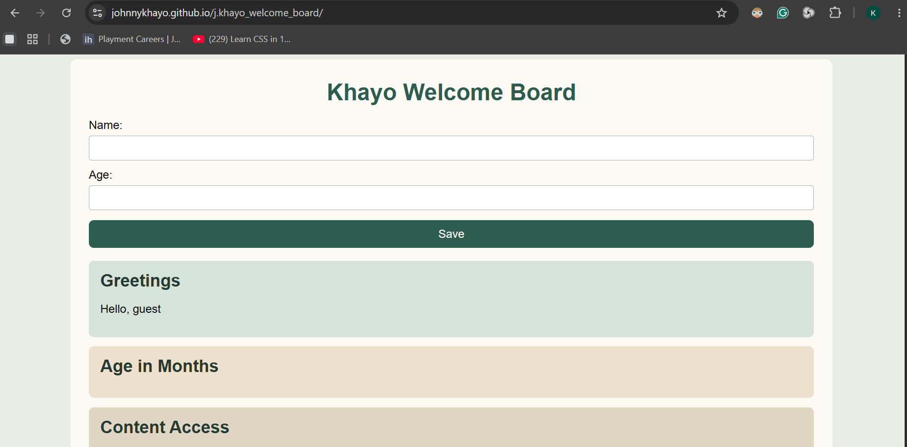

# Khayo Welcome Board
**Khayo Welcome Board** is a small personal welcome page. A user enters their name and age, and the page shows a greeting, the age in months, an access message, and a short quote.
## Problem statement
New JavaScript learners need one simple page that practices forms, conditions, functions, loops, and localStorage together. Without that, each topic stays in the console and never becomes a real webpage.
## Solution
This project collects name and age in a form, saves them in the browser with localStorage, and updates the page. After a refresh, the saved details still appear.
## Features
- Form for name and age
- Personalized greeting using template literals
- Age converted to months with a function
- if/else message for users under or over 18
- Motivational quote printed five times with a loop
- Simple custom CSS layout
## Tech stack
- HTML
- CSS
- JavaScript
- Git and GitHub
## File Structure
```
- index.html
- style.css
- script.js
- README.md
```
### Installation setup
```
git clone https://github.com/JohnnyKhayo/j.khayo_welcome_board.git
```
*right click* and **open live server** or ***go live***
### How the project looks like



### Collaboration and contribution
For anyone interested in contributing and collaborating to this project. Please feel free and follow the steps below.
1. Clone the project
```
git clone https://github.com/JohnnyKhayo/j.khayo_welcome_board.git
```
2. make a pull request
3. document the contribution as an issue

#### License
This project was created and build by @Johnnykhayo under MIT License
